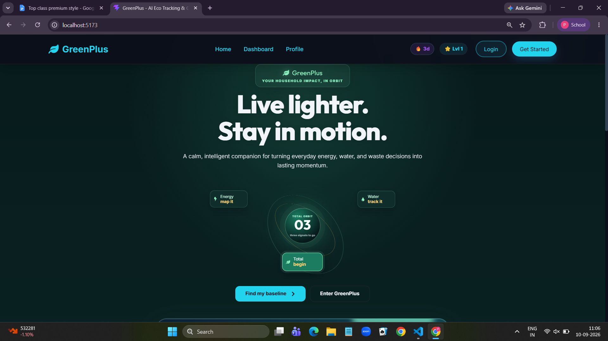

# GreenPlus Database

MongoDB runs locally at `mongodb://127.0.0.1:27017` by default. The database name is `greenplus`.

## Collections

- `users`: account identity, password hash, profile level, XP, streak, and outfit.
- `notifications`: user-scoped event messages, delivery metadata, read state, expiry, and event fingerprints.

Notification records contain `id`, `userId`, `type`, `priority`, `title`, `message`, `language`, `action`, `metadata`, `channels`, `eventHash`, `read`, `dismissed`, `createdAt`, and `expiresAt`. The notification service applies cooldown, duplicate, daily-limit, and quiet-hour checks before creating records.

All MongoDB access goes through `backend/database/` and repository classes. Routes do not access collections directly. The Mongo client is cached for the process and uses a short server-selection timeout so a missing database does not hang the API.

Override connection settings with `MONGO_URI` and `MONGO_DB_NAME` environment variables.
